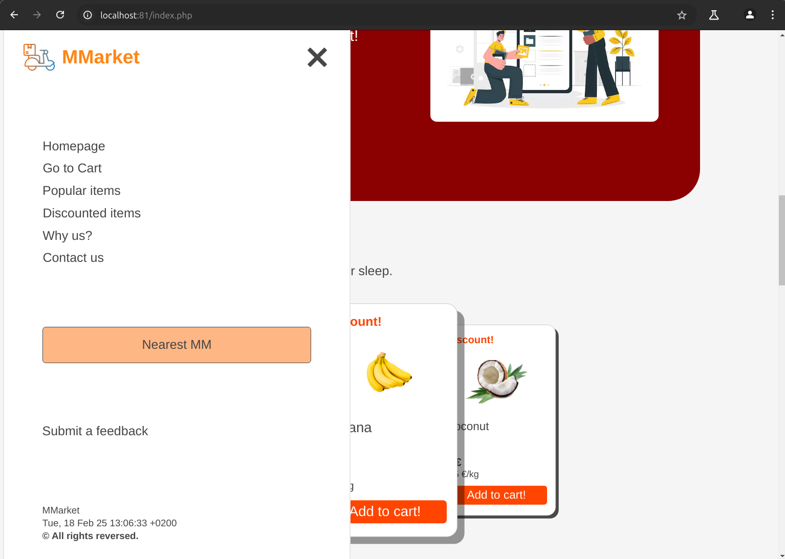
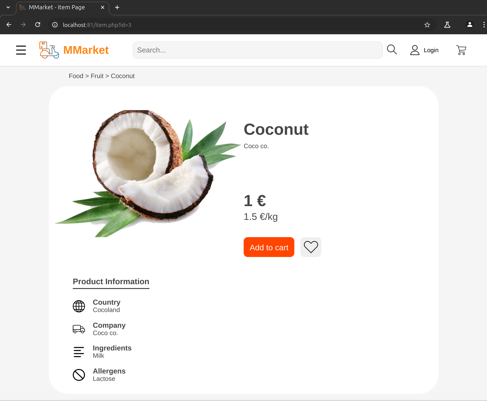
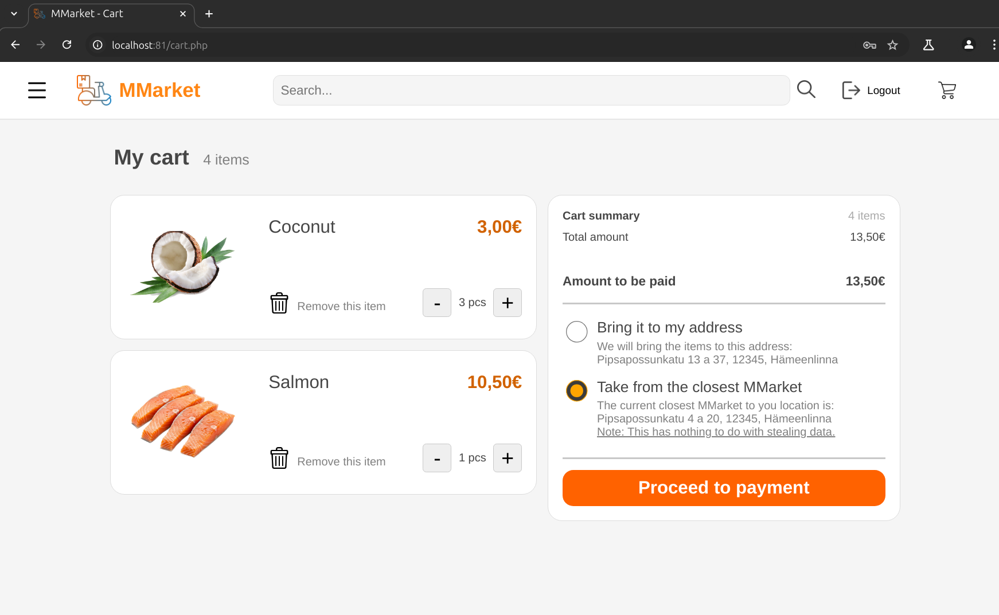
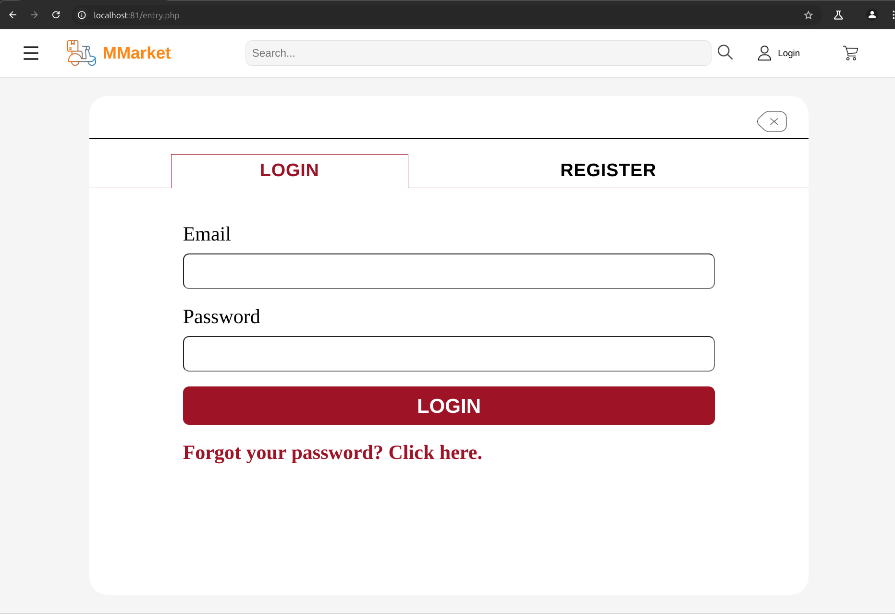
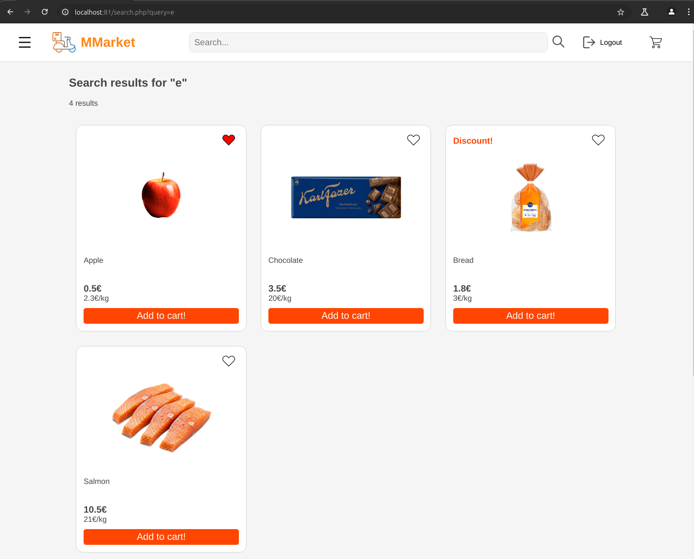

# Web programming - MMarket - Group 7
## Project info
For this project, the main goal is to create and implement certain functionalities to a webpage, which is dedicated on online groceries, such as:
- A dynamic webpage that is using PHP as a backend.
- A database alongside PHP where the data can be retrieved/manipulated through the webpage.
- JavaScript and PHP scripts to improve the data validation and dynamic content.

## Tasks
- [x] **Dynamic Header & Footer**
- [x] **User table**
- [x] **Product table**
- [x] **Cart table**
- [x] **Favourite products table**
- [x] **Job table**
- [x] **Database connection**
- [x] **Dynamic Product page**
- [x] **Dynamic Cart page**
- [x] **Login & Registration**
- [x] **User Session**
- [x] **Search bar**

# Dynamic Header and Footer

In order to avoid repetition, `header.php` and `footer.php` are created. They are extracted from each page, yet added through include method in PHP. 

## Header

By using variables like `$title` and `$css_file`, it is possible to use page-specific values and files.

Basic `header.php` implementation:

```php
<?php
    $title = "Page name";
    $css_file = "page";
    include("header.php");
?>

// rest of the code here ...
```

## Footer

Basic `footer.php` implementation:

```php
// ... beginning of the code here

<?php 
    include("footer.php");
?>
```

## Dynamic Sidebar (Navbar)

A sidebar is implemented to improve user experience on the page. For this functionality, JavaScript is used for the on-click event listener for the nav menu.



# Tables

The tables created for MySQL database to retrieve live data to webpage.

## User Table
The users that registered to database. It is necessary to be logged into webpage in order to use functionalities like adding item to cart or adding it to (personal) favorites.

| Column Name  | Data Type        | Key           |
|--------------|-----------------|---------------|
| `userid`     | `int`            | `PRIMARY KEY` |
| `fname`      | `varchar(50)`    | `NOT NULL`    |
| `lname`      | `varchar(50)`    | `NOT NULL`    |
| `email`      | `varchar(50)`    | `NOT NULL`    |
| `password`   | `varchar(50)`    | `NOT NULL`    |
| `iscorp`     | `tinyint(1)`     | `DEFAULT '0'` |


## Product Table
The table to keep data of the market products. 

| Column Name           | Data Type        | Key        |
|----------------------|-----------------|------------|
| `itemid`            | `int`            | `PRIMARY KEY` |
| `item_name`         | `varchar(50)`    |            |
| `img`               | `varchar(50)`    |            |
| `price`             | `float`          |            |
| `price_kilo`        | `float`          |            |
| `item_type`         | `varchar(50)`    |            |
| `country`           | `varchar(50)`    |            |
| `company`           | `varchar(50)`    |            |
| `ingred`            | `varchar(50)`    |            |
| `allergies`         | `varchar(50)`    |            |
| `isDiscount`        | `tinyint(1)`     | `NOT NULL DEFAULT '0'` |
| `discount_percentage` | `float`        |            |


## Cart Table
The table made to save people's cart data permanently. The table is using `userid` and `itemid` as foreign keys.

| Column Name  | Data Type | Key                 |
|-------------|----------|---------------------|
| `cartid`    | `int`    | `PRIMARY KEY`       |
| `userid`    | `int`    | `FOREIGN KEY`       |
| `itemid`    | `int`    | `FOREIGN KEY`       |
| `quantity`  | `int`    | `NOT NULL DEFAULT '1'` |


## Favorite Products Table
The table made to save people's favorite items. Similar to the cart table, it uses `userid` and `itemid` as foreigner keys.

| Column Name  | Data Type | Key                        |
|-------------|----------|----------------------------|
| `fav_id`    | `int`    | `PRIMARY KEY`              |
| `userid`    | `int`    | `FOREIGN KEY`              |
| `itemid`    | `int`    | `FOREIGN KEY`              |


## Job Table
The table for the current jobs in `jobs.php` page.

| Column Name  | Data Type     | Key        |
|-------------|-------------|------------|
| `job_id`    | `int`        | `PRIMARY KEY` |
| `name`      | `varchar(50)` | `NOT NULL` |
| `startdate` | `date`       |            |
| `enddate`   | `date`       |            |
| `location`  | `varchar(50)` |            |
| `postcode`  | `varchar(50)` |            |

# Database Connection

Connection is made to a MySQL database using PHP. The connection is established with the help of the mysqli library. Here is the `db.php` file used for basic database connection for the pages that need it.

```php
<?php
$servername="db";
$username="root";
$password="password";
$dbname ="mmarket";
// creating connection 
$conn = new mysqli($servername, $username, $password, $dbname);

// checking connection
if ($conn->connect_error) 
    die("Connection failed: ".$conn->connect_error);

?>
```

# Dynamic Product Page

The product page is fully dynamic. 



The product data is retrieved from `items` table in MySQL database.

The user can add the product to the cart, and/or add it to their favorites.

On top of that, top categorization in functional. If the user clicks on the anchor of the type, they will get redirected to search page with query of that type, which will also show results.

# Dynamic Cart Page

Cart page is also fully dynamic.



The user must be logged in in order to access to this page. If they try to access without logging in, they will get redirected to login/register page.

The page retrieves data from `carts` table from MySQL database. The data that is shown in the page belongs to the user (via `userid`) and shows each `carts` query that matches with that `userid`.

When an item is on the cart, the user can remove the item from their cart. They can also increase/decrease the amount of the products (via PHP). All of these actions will update the table data real-time.

The product prices and cart total price is also calculated through the script and it is accurate.

# Login & Registration

This part is necessary to keep user data.



## Logging in

The user enters their email and password to an HTML form in order to log in and access their data. The credentials they enter is checked through `login.php` and they will get redirected to index page if there is match, otherwise a JavaScript alert will warn the user to re-enter their credentials.

## Registering

If user wants to register, they can fill the HTML form and they will have to login after that. The `users` table will get updated after registration.

## Logging out

If user wants to log out, a PHP script will run in order to terminate the session:

```php
<?php
session_start();
session_unset();
session_destroy();
header("Location: index.php");
exit();
?>
```

# User Session

User session is added to each page in order to provide an unity between pages.

- For pages that does not require user privilages:

```php
session_start();
```

- For pages that require user privilages:

```php
session_start();

if (!isset($_SESSION['userid'])) {
    header("Location: entry.php");
    exit();
}
```

This will automatically redirect the person the login page.

# Searchbar

A search functionality is necessary in this kind of a website meant for groceries.



When the user enters a query a searchbar, they will get redirected to a page for the results of the query. There are 2 possible outcomes that a result will show up:

- the query is within the product name,
- the query is within the product type (such as Fruit, Meat, Diary etc.)

For each result, the PHP script will iterate through all results and make a search result box with their dedicated product page anchored.